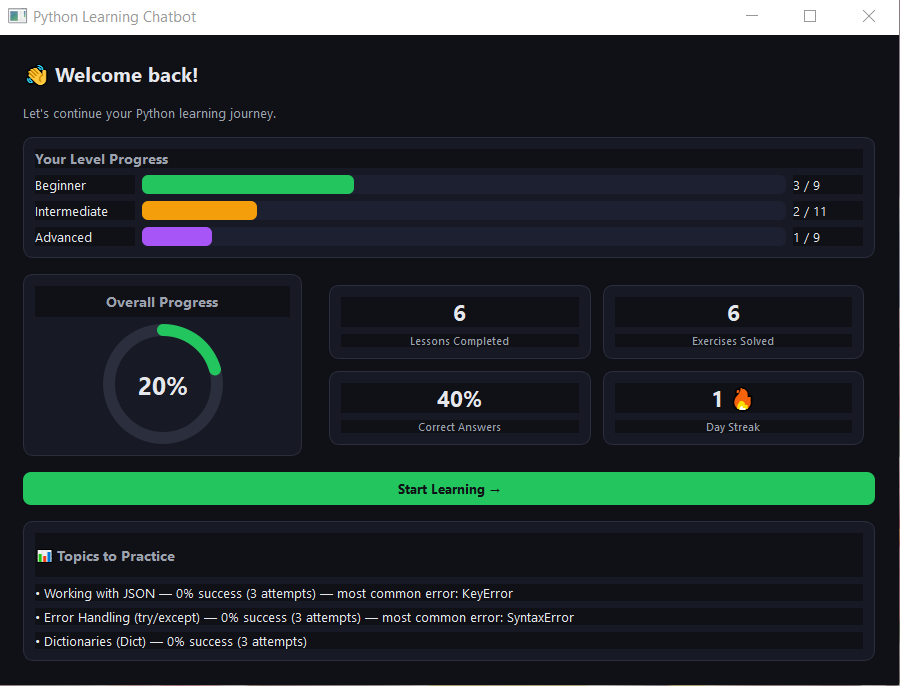
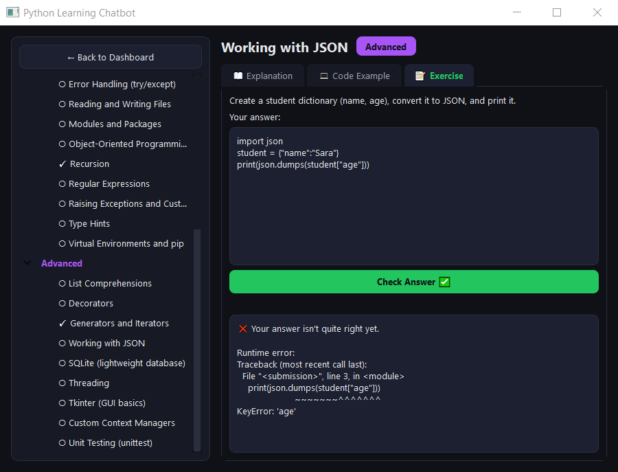
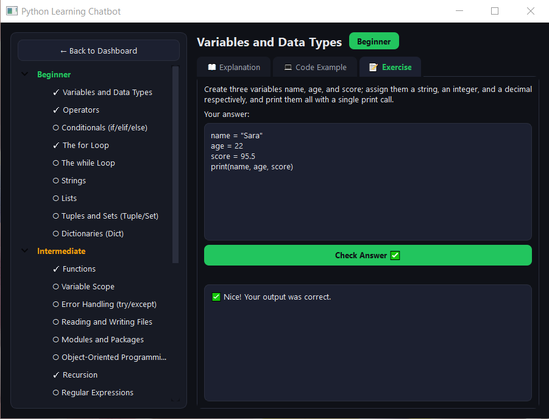

# Python Learning Chatbot


A desktop app (PyQt5) for learning Python: browse lessons by skill
level, safely execute a student's exercise code in a sandbox, and grade
it by comparing actual program output against a reference answer
(not by comparing source text).

## Screenshots

**Dashboard** — level progress, overall completion ring, exercise stats, and a personalized "topics to practice" panel:



**Exercise with error feedback** — a runtime error is caught by the sandbox and shown with a clean traceback:



**Exercise passed** — the sidebar checkmarks track completed lessons per level:



## Setup & running

```bash
python3 -m venv venv
source venv/bin/activate        # Windows: venv\Scripts\activate
pip install -r requirements.txt
python3 chatbot.py
```

Requirements: Python 3.9+. On Linux, the copy button also needs
`xclip` or `xsel` installed (`sudo apt install xclip`).

## Architecture

```
project/
├── .github/
│   └── workflows/
│       └── tests.yml     # Runs the test suite automatically on every push (CI)
├── .gitignore
├── screenshots/           # Images used in this README
├── chatbot.py            # UI only (PyQt5) — no grading logic lives here
├── lessons.py             # Lesson content (explanation, sample code, exercise, reference answer)
├── grader/
│   ├── sandbox.py         # Isolated execution via subprocess (no external dependency)
│   ├── sandbox_docker.py  # Isolated execution via a Docker container (industry standard)
│   └── grading.py         # Compares actual stdout against the reference answer
├── progress/
│   └── db.py              # SQLite: records attempts + "which topics are hardest" stats
├── tests/
│   ├── test_sandbox.py
│   ├── test_sandbox_docker.py  # Real tests (need Docker) + a graceful-fallback test
│   ├── test_grading.py    # Includes an integration test against the real lessons.py
│   └── test_db.py
└── requirements.txt
```

Deliberate separation: `chatbot.py` contains no grading or SQL logic —
it's UI only. That means `grader` and `progress` can be tested without
ever starting PyQt (and that's exactly how all the tests work).

## Running the tests

```bash
python3 -m unittest discover tests -v
```

No `pytest` needed — everything runs on the standard-library
`unittest` module.

## Two backends for safe code execution

The project supports two ways to run student code in isolation:

| | `grader/sandbox.py` (default) | `grader/sandbox_docker.py` |
|---|---|---|
| External dependency | None | Requires Docker installed |
| Fork-bomb prevention | ❌ None (see below for why) | via cgroups `--pids-limit` (enforced even for root) |
| Network | Not blocked | Fully disabled (`--network none`) |
| Filesystem | Only the working directory is isolated | Fully read-only |
| Good for | Fast development, environments without Docker | Real (production) deployment |

To switch to Docker, set this environment variable before running:

```bash
docker pull python:3.12-slim   # only needed once
export SANDBOX_BACKEND=docker
python3 chatbot.py
```

If Docker isn't installed or running, the system returns a clear error
message instead of crashing ("Docker is not installed or its daemon
isn't running...").

## Why grade on output, not on source text?

Two pieces of code that are logically equivalent can look completely
different in text (variable names, spacing, `range(n)` vs.
`range(0, n)`). Instead of comparing text, both the student's code and
the reference answer are run in the same sandbox, and their
**stdout** is compared.

Known limitation: exercises with non-deterministic output (e.g.
printing elapsed time) need a `mask_patterns` entry in `lessons.py` so
that part is ignored before comparison (example: the "Decorators"
lesson). Purely graphical exercises (like Tkinter) are marked with
`"auto_gradable": False`, since they never produce comparable stdout.

## Security notes (honest, not just marketing)

`grader/sandbox.py` runs student code in a separate subprocess with
CPU, memory, and wall-clock timeout limits. This level of isolation is
acceptable for fast development or environments without Docker, but it
has known limitations:

- **⚠️ It does not defend against a fork bomb.** This was not a design
  choice made lightly — it went through two real, failed fixes first.
  A fixed `RLIMIT_NPROC` of 1 silently broke any exercise using the
  `threading` module (since Linux counts threads against this limit
  too, not just forked processes). Computing the limit dynamically
  (current process count for the user + a fixed headroom) *still*
  failed on GitHub Actions, because `RLIMIT_NPROC` counts every
  process/thread for that user ID **system-wide**, not just this
  subprocess's own descendants — and that system-wide baseline turned
  out to vary unpredictably across environments. Neither failure ever
  showed up in this project's own development environment, because it
  ran as root, and root is exempt from `RLIMIT_NPROC` entirely — which
  is exactly why it took two different real, non-root runs (once
  crashing the dev environment directly, once failing in CI) to
  uncover both problems. Rather than guess a third number, this
  backend now leaves `RLIMIT_NPROC` alone and relies on
  `sandbox_docker.py` for real fork-bomb protection.
- **⚠️ Never run this as root/Administrator anyway.** Even without
  `RLIMIT_NPROC`, root is exempt from `RLIMIT_CORE`/`RLIMIT_NOFILE`
  too. In production this should run as an unprivileged system user.
- This sandbox does not fully block network or filesystem access.

`grader/sandbox_docker.py` closes these gaps: `--network none` fully
disables networking, `--read-only` makes the filesystem read-only,
and — most importantly — `--pids-limit` provides real fork-bomb
protection via **cgroups**, which (unlike `rlimit`) is scoped to the
container itself rather than the whole machine, so it doesn't inherit
the system-wide-baseline problem above. This is the same approach real
code-judging platforms use (like the open-source project Judge0). This
backend is recommended for real deployments, and is the only one of
the two that meaningfully protects against a fork bomb.

- On Windows (with the default backend), the `resource` module doesn't
  exist; only the wall-clock timeout remains as protection.

## Known UI limitation

Running the sandbox can take a few seconds. To avoid freezing the UI,
this work runs on a separate `QThread` (`GradingWorker` in
`chatbot.py`), not on the main UI thread.

## Analytics

`progress/db.py` records student attempts in SQLite (without storing
the full code — just its length and the result), and
`get_struggling_topics` returns the topics with the lowest success
rate (with a minimum-attempts threshold, so a single random failure
doesn't wrongly get flagged as the "hardest" topic).
